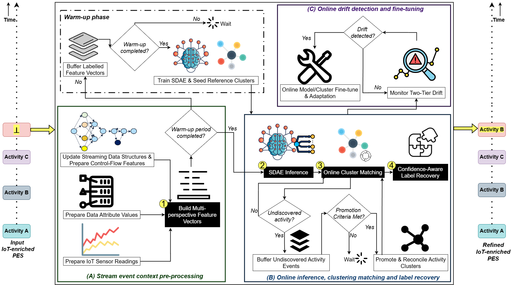
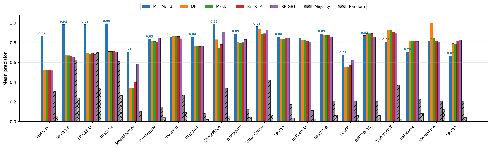
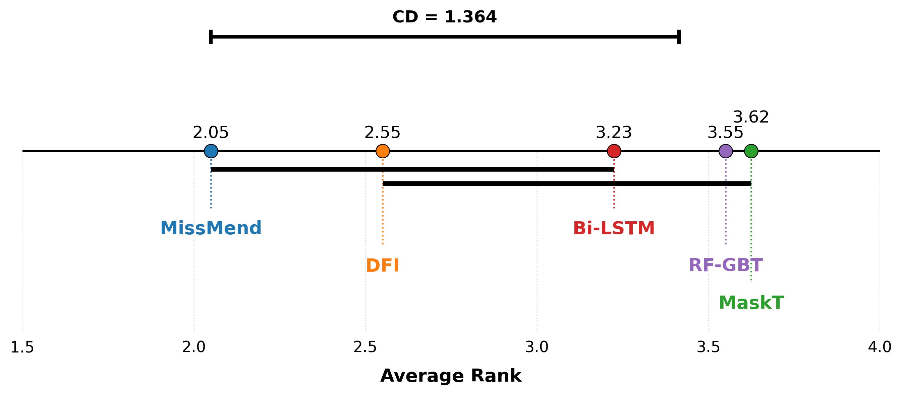
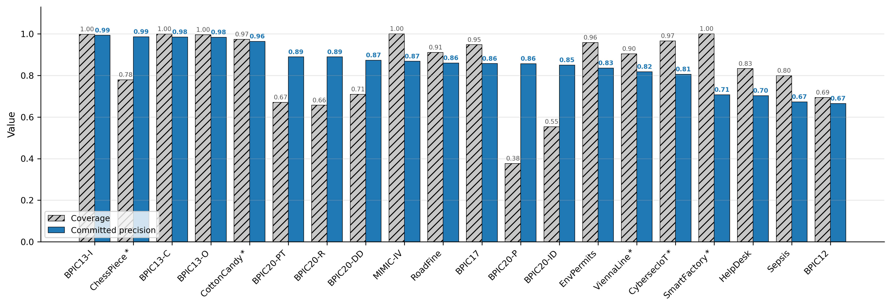

# MissMend: Online Repair of Missing Activity Labels in IoT-enriched Process Event Streams

[-blue)]()
[](https://www.python.org/)
[](https://pytorch.org/)
[](LICENSE)

Source code and additional resources for the paper **"MissMend: Online repair of missing activity labels in IoT-enriched process event streams"** by Savandi Kalukapuge, Andrzej Janusz, and Moe Thandar Wynn.

MissMend is a streaming framework for recovering **missing activity labels** in IoT-enriched process event streams. It processes events one at a time in arrival order under bounded memory and bounded latency, and for each event with a missing `concept:name` it either commits a repaired label with a calibrated confidence and a provenance flag, or abstains.

## Key Contributions

1. **The first framework for online missing-activity-label repair in process event streams**, operating in a single-pass, bounded-memory setting rather than over complete offline traces.

2. **A confidence-aware repair mechanism** that matches each event's multi-perspective representation (control-flow, event attributes, and IoT sensor readings, encoded jointly by a sparse denoising autoencoder) against streaming per-activity reference clusters, emitting every repair with a calibrated confidence and a provenance flag, or abstaining when uncertain.

3. **The first method to exploit the IoT sensor evidence** carried in process event streams as a discriminative signal for label repair, together with online open-vocabulary discovery of unseen activities and two-tier ADWIN-based drift adaptation.

## Approach Overview



## Installation

Requires Python 3.11.

```bash
git clone https://github.com/Savandi/MissMend.git
cd MissMend
python3.11 -m venv .venv
source .venv/bin/activate        # Linux/Mac (or: .venv\Scripts\activate on Windows)
pip install -r requirements.txt
```

## Quick Start

Run the self-contained example (no external data required):

```bash
python examples/run_missmend_minimal.py
```

It streams a short synthetic log through the pipeline and prints the repair decision (recovered label, confidence, and provenance flag) for each event.

## Usage on a real log

```python
from src.streaming_ml_repair.pipeline.streaming_ml_repair import StreamingMLRepairPipeline
from config.default_config import get_config
from data.parsers.datastream_xes_parser import DataStreamXESParser

config = get_config("chess")                    # per-dataset config (see HYPERPARAMETERS.md)
pipeline = StreamingMLRepairPipeline(config)

events = DataStreamXESParser("/path/to/log").parse()
for result in pipeline.process_stream(events):
    # result: original_label, recovered_label, confidence, provenance, event
    ...
```

Each event exposes `case_id`, `concept_name`, `timestamp`, `lifecycle`, `resource`, `attributes`, and `sensor_readings`. A missing label is signalled by `concept_name` being `None` or empty. Every committed repair carries one of the provenance flags `RECOVERED_ML`, `RECOVERED_ML_SEQ`, or (for a discovered new activity) `UNDISCOVERED_N`; an abstention is flagged `UNRECOVERED_ML`.

## Evaluation Metrics

Repair quality is measured in the **streaming** form (each decision uses only state accumulated up to the arriving event):

- **Precision** — fraction of committed repairs whose label matches the ground truth.
- **Coverage** — fraction of missing events on which a label is committed rather than abstained.
- **Recall** — fraction of missing events correctly repaired (an abstention counts as a false negative).
- **F1** — harmonic mean of precision and recall.

For the process event streams with **naturally** missing labels (no ground truth), the **natural recovery rate** and the **mean composite confidence** on committed vs. abstained subsets are reported instead.

**Operational feasibility:** runtime, mean and 99th-percentile per-event latency, and peak resident memory.

## Key Experimental Results

**Mean precision per PES (injection rate 0.10)**



MissMend attains the **highest mean precision on 13 of the 20** process event streams.

**Statistical comparison of precision (Friedman + Nemenyi)**

Using the Friedman test (χ²(4) = 15.0, *p* = 0.005) with a Nemenyi post-hoc analysis (α = 0.05, critical difference = 1.36), **MissMend attains the best mean rank (2.05)** on committed precision and **significantly outperforms MaskT and RF-GBT**, while being statistically tied with DFI and Bi-LSTM.



**Coverage vs. committed precision, per PES**

The confidence gate trades coverage, not precision: committed precision stays high across streams while coverage flexes to match the signal.



## Datasets

### IoT-enriched Process Event Streams (primary group)

Four of the six contain **naturally missing** activity labels; the other two (SmartFactory, MIMIC-IV) have complete labels and are used for controlled injection. CybersecIoT and MIMIC-IV are evaluated on a fixed stream prefix for tractability.

| PES | Events | Cases | Activities | Domain | Natural missing | Ref |
|-----|--------|-------|------------|--------|-----------------|-----|
| **ChessPiece** | 10,557 | 234 | 63 | Smart manufacturing | ~15.6% | [5] |
| **CottonCandy** | 12,975 | 29 | 44 | Smart manufacturing | ~11.5% | [6] |
| **SmartFactory** | 21,913 | 272 | 130 | Smart manufacturing | injection | [7] |
| **ViennaLine** | 275,986 | 1 | 8 | Transportation | ~5% | [8] |
| **CybersecIoT** | 100,000\* | 1,406 | 38 | Cybersecurity | ~1% | [9] |
| **MIMIC-IV** | 489,370\* | 10,569 | 18\*\* | Healthcare | injection | [10] |

\* Fixed stream prefix (very large source log). \*\* After a top-18 activity-vocabulary filter applied at the loader. Full source citations for all datasets are in the paper.

### Non-IoT Process-Mining Benchmarks (secondary group)

Standard public process-mining benchmarks; full source citations are in the paper.

| PES | Events | Cases | Activities | Description | Ref |
|-----|--------|-------|------------|-------------|-----|
| **BPIC12** | 262,200 | 13,087 | 36 | Loan application (Dutch financial institution) | [11] |
| **BPIC13-C** | 6,660 | 1,487 | 7 | Incident management, closed (Volvo IT) | [12] |
| **BPIC13-I** | 65,533 | 7,554 | 13 | Incident management, incidents (Volvo IT) | [13] |
| **BPIC13-O** | 2,351 | 819 | 5 | Incident management, open (Volvo IT) | [14] |
| **BPIC17** | 1,202,267 | 31,509 | 26 | Loan application (updated system) | [15] |
| **BPIC20-DD** | 56,437 | 10,500 | 17 | Travel expenses – Domestic Declarations | [16] |
| **BPIC20-ID** | 72,151 | 6,449 | 34 | Travel expenses – International Declarations | [16] |
| **BPIC20-P** | 86,581 | 7,065 | 51 | Travel expenses – Permit | [16] |
| **BPIC20-PT** | 18,246 | 2,099 | 29 | Travel expenses – Prepaid Travel Cost | [16] |
| **BPIC20-R** | 36,796 | 6,886 | 19 | Travel expenses – Request for Payment | [16] |
| **Sepsis** | 15,214 | 1,050 | 16 | Hospital sepsis-treatment traces | [17] |
| **RoadFine** | 561,470 | 150,370 | 11 | Road Traffic Fine Management | [18] |
| **EnvPermits** | 8,577 | 1,434 | 27 | Environmental-permit application, receipt phase (CoSeLoG) | [19] |
| **HelpDesk** | 21,348 | 4,580 | 14 | Italian help-desk ticketing | [20] |

## Baseline Methods

MissMend is compared against four research baselines (each adapted to the same single-pass streaming setting) and two naive lower bounds.

| Method | Reference | Type |
|--------|-----------|------|
| **Bi-LSTM** | Lu et al. (2022) [1] | Dual bidirectional LSTM over prefix + suffix + resource embedding |
| **MaskT** | Wu et al. (2024) [2] | Masked Transformer, BERT-style label-masking objective |
| **DFI** | Yuan et al. (2025) [3] | Interpretable dual-layer fusion; missing-value imputation over attributes |
| **RF-GBT** | Aversano et al. (2025) [4] | Random forest + gradient-boosted trees (tabular) |
| **Majority** | — | Emits the most frequent activity seen so far (naive floor) |
| **Random** | — | Emits a uniformly random activity from the observed vocabulary (naive floor) |

## Results Summary

**Overall repair quality**

| Method | Mean F1 | Mean precision rank |
|--------|---------|---------------------|
| Bi-LSTM | 0.783 | 3.23 |
| RF-GBT | 0.780 | 3.55 |
| DFI | 0.775 | 2.55 |
| **MissMend** | **0.769** | **2.05 (best)** |
| MaskT | 0.758 | 3.62 |

MissMend leads on **precision** (best mean rank; best on 13/20 PESs) and trades recall for precision by design — it abstains at a mean coverage of 0.84, and the abstention-as-false-negative convention charges each abstention against F1, keeping its F1 within 0.014 of the strongest baseline while committing far more reliable repairs.

**Operational feasibility (single-thread CPU)**

- Mean per-event latency: **2.5 – 20 ms**; 99th-percentile latency under 100 ms on every stream except SmartFactory (309 ms).
- Peak resident memory: **under 2.6 GB** on the largest stream, below 1 GB on most.
- Sustained throughput: ~200 – 300 events/second per core.

## Reproducibility

This repository provides the **MissMend framework** and a self-contained **ChessPiece** example so the pipeline can be run end-to-end without external data. `evaluation/run_controlled_evaluation.py` reproduces MissMend's own controlled-injection metrics (uniform random label removal at rates 0.05–0.30, three seeds; precision, recall, coverage, F1). Point `DATASET_PATHS` in `data/parsers/datastream_xes_parser.py` at your local copies of the logs first.

The **baseline methods** (Bi-LSTM, MaskT, DFI, RF-GBT) are re-implementations of prior work; they are described and cited in the paper and are **not redistributed here**. The **twenty evaluation logs** are obtained from their original public sources (see the Datasets tables and the links disclosed in the paper); only ChessPiece is bundled.

## Building the IoT DataStream XES logs

The parsers in `data/parsers/` **read** DataStream XES logs; the scripts that **build** the CybersecIoT and MIMIC-IV DataStream XES logs from their raw sources are provided in `data/datastream_xes/`. The other four IoT logs (ChessPiece, CottonCandy, SmartFactory, ViennaLine) are used as published by their authors (see the Datasets table). Input and output locations are set as constants at the top of each script; edit them to your local paths before running.

**CybersecIoT** — from the FedCSIS 2023 (AAIA) cyber-attack-on-IoT system-call logs [9]:

1. Download the SPINET train/test CSV logs and set `TRAIN_PATH`, `TEST_PATH`, and `OUTPUT_DIR` at the top of `create_cybersec_iot_datastream_xes.py`.
2. `python data/datastream_xes/create_cybersec_iot_datastream_xes.py` — writes `MainProcess.xes` plus one `subprocesses/<uuid>.xes` per one-minute capture window (traces per process, with `stream:datastream` IoT sensor readings embedded per event).
3. `python data/datastream_xes/fix_cybersec_mainprocess_xes.py` — applies the MainProcess index/log-window fix.

**MIMIC-IV** — requires **credentialed PhysioNet access** to MIMIC-IV and MIMIC-IV-ED under their Data Use Agreement. The raw data cannot be redistributed, so supply your own download:

1. Obtain MIMIC-IV (`hosp/`, `icu/`) and MIMIC-IV-ED (`ed/`), then set `HOSP_PATH`, `ICU_PATH`, `ED_PATH`, `OUTPUT_PATH`, and `DB_PATH` at the top of `create_mimiciv_datastream_xes.py`.
2. `python data/datastream_xes/create_mimiciv_datastream_xes.py` — loads the raw `.csv.gz` modules into a local DuckDB and emits the DataStream XES part files (admissions batched per file) into `OUTPUT_PATH`.

The evaluation then reads these logs through `data/parsers/streaming_xes_parser.py`, applying the CybersecIoT first-100,000-event prefix and the MIMIC-IV top-18-of-first-500,000-events subset used in the paper.

## Repository layout

```
src/streaming_ml_repair/     the framework
  pipeline/                  streaming orchestrator (entry point)
  sdae/                      sparse denoising autoencoder + losses
  clustering/                streaming fuzzy BFR reference clusters
  undiscovered/              candidate-activity BFR (open-vocabulary discovery)
  feature_vector/            control-flow, data, and IoT feature builders
  sequence_head/             LSTM rescue head, count cache, class-balanced reservoir
  streaming_dfg/             online directly-follows graph
  calibration/               temperature / Platt scalers
  drift/                     two-tier ADWIN drift detection
config/default_config.py     shared defaults + per-dataset settings
data/parsers/                DataStream XES, BPIC XES, and CSV loaders
data/datastream_xes/         scripts to build the CybersecIoT and MIMIC-IV DataStream XES logs
evaluation/                  metrics, label injection, and a controlled-evaluation runner
examples/                    minimal runnable example
images/                      figures used in this README
HYPERPARAMETERS.md           complete hyperparameter value sets and per-dataset settings
```

## Configuration

`config/default_config.py` holds `DEFAULT_CONFIG` (shared defaults) and `DATASET_CONFIGS` (per-dataset overrides). `get_config(name)` returns the merged configuration. See [`HYPERPARAMETERS.md`](HYPERPARAMETERS.md) for the full value sets explored during tuning and the selected per-dataset settings.

## References

**Baseline methods**

1. Lu, Y., Chen, Q., & Poon, S. K. (2022). A deep learning approach for repairing missing activity labels in event logs for process mining. *Information*, 13(5), 234. https://doi.org/10.3390/info13050234
2. Wu, P., Fang, X., Fang, H., Gong, Z., & Kan, D. (2024). An event log repair method based on masked Transformer model. *Applied Artificial Intelligence*, 38(1). https://doi.org/10.1080/08839514.2024.2346059
3. Yuan, Y., Fang, X., Lu, K., & Zhang, Z. (2025). An interpretable deep fusion framework for event log repair. *Information Systems*. https://doi.org/10.1016/j.is.2025.102548
4. Aversano, L., Iammarino, M., Madau, A., Montano, D., & Verdone, C. (2025). Repairing missing activity labels in healthcare process logs: a machine learning approach. In *KES InMed 2024*. https://doi.org/10.1007/978-981-97-7498-2_9

**IoT-enriched datasets**

5. Mangler, J., & Ehrendorfer, M. (2023). *XES Chess Pieces Production* [dataset]. Zenodo. https://doi.org/10.5281/zenodo.7958478
6. Arteaga Garcia, N., & Mangler, J. (2025). *Cotton Candy XES YAML* [dataset]. Zenodo. https://doi.org/10.5281/zenodo.17226615
7. Malburg, L., Grüger, J., & Bergmann, R. (2023). *An IoT-enriched event log for process mining in smart factories* [dataset]. Figshare. https://doi.org/10.6084/m9.figshare.20130794
8. Mangler, J., & Kunkler, M. (2023). *XES Logistics and Transportation Dataset — Large (~19 days)* [dataset]. Zenodo. https://doi.org/10.5281/zenodo.7528638
9. Czerwiński, M., et al. (2023). Cybersecurity threat detection in the behavior of IoT devices. In *FedCSIS 2023*. https://doi.org/10.15439/2023F3089
10. Johnson, A. E. W., et al. (2023). MIMIC-IV, a freely accessible electronic health record dataset. *Scientific Data*, 10, 1. https://doi.org/10.1038/s41597-022-01899-x

**Non-IoT benchmarks (4TU.ResearchData / TU Eindhoven)**

11. van Dongen, B. (2012). *BPI Challenge 2012* [dataset]. 4TU.ResearchData. https://doi.org/10.4121/uuid:3926db30-f712-4394-aebc-75976070e91f
12. Steeman, W. (2013). *BPI Challenge 2013, closed problems* [dataset]. 4TU.ResearchData. https://doi.org/10.4121/uuid:c2c3b154-ab26-4b31-a0e8-8f2350ddac11
13. Steeman, W. (2013). *BPI Challenge 2013, incidents* [dataset]. 4TU.ResearchData. https://doi.org/10.4121/uuid:500573e6-accc-4b0c-9576-aa5468b10cee
14. Steeman, W. (2013). *BPI Challenge 2013, open problems* [dataset]. 4TU.ResearchData. https://doi.org/10.4121/uuid:3537c19d-6c64-4b1d-815d-915ab0e479da
15. van Dongen, B. (2017). *BPI Challenge 2017* [dataset]. 4TU.ResearchData. https://doi.org/10.4121/uuid:5f3067df-f10b-45da-b98b-86ae4c7a310b
16. van Dongen, B. (2020). *BPI Challenge 2020* [dataset]. 4TU.ResearchData. https://doi.org/10.4121/uuid:52fb97d4-4588-43c9-9d04-3604d4613b51
17. Mannhardt, F. (2016). *Sepsis cases — event log* [dataset]. 4TU.ResearchData. https://doi.org/10.4121/uuid:915d2bfb-7e84-49ad-a286-dc35f063a460
18. de Leoni, M., & Mannhardt, F. (2015). *Road traffic fine management process* [dataset]. 4TU.ResearchData. https://doi.org/10.4121/uuid:270fd440-1057-4fb9-89a9-b699b47990f5
19. Buijs, J. (2022). *Receipt phase of an environmental permit application process (WABO), CoSeLoG project* [dataset]. 4TU.ResearchData. https://doi.org/10.4121/12709127.v2
20. de Leoni, M. (2015). *Helpdesk event log of an Italian software company* [dataset]. 4TU.ResearchData. https://doi.org/10.4121/uuid:0c60edf1-6f83-4e75-9367-4c63b3e9d5bb

## Acknowledgments

This work was conducted at the Queensland University of Technology (QUT), School of Information Systems, Faculty of Science. The first author is supported by a Food Agility CRC scholarship, funded under the Australian Government's Cooperative Research Centres (CRC) Program.

## License

Licensed under the Apache License 2.0. See [LICENSE](LICENSE).
